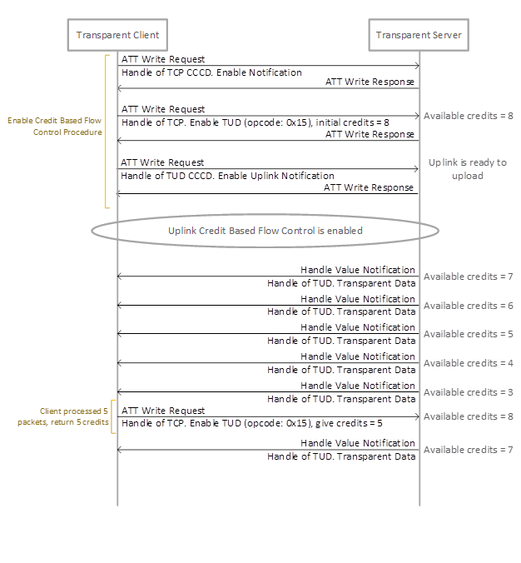

# Uplink Credit Based Flow Control \(UCBFC\)

The procedure is used by a Transparent Client to enable Uplink Credit Based Flow Control on the  Transparent Server. Once it is enabled, Server role can only send data to Client while  the credit count is greater than zero.

When enable Uplink Credit Based Flow Control, Client shall write “Uplink Credit Based  Flow Control Enable� opcode \(0x15\) to the Transparent Control Point on Transparent  Server. There are given Credit value parameter in this opcode. Transparent Server will  check the credit count to know how many packets can be uploaded to the Transparent  Client by performing the notify operation to TUD Characteristic handle. The Credit count  will be decreased by the number of ATT packet sending by Transparent Server. Transparent  Server can send data only while the credit count is greater than zero. Transparent  Client shall return the credit value to Transparent Server after the received data has  been processed completed.

When enable Credit Based Flow Control Uplink and available credits on Client shall be  written to the Transparent Control Point on Transparent Server. Transparent Server will  check the number of credit to know how many available data list can transmit to the  Transparent Client. The number of credit is decrease by the list of data sending by  Transparent Server. Transparent Server is able to send data only while the number of  credit is non-zero. Transparent Client shall return the credit to Transparent Server  after the received data has been processed completed.

**Parent topic:**[Transparent Control Point Characteristic Behavior](GUID-7A2BC74D-E714-41F0-8201-0D183867E570.md)

