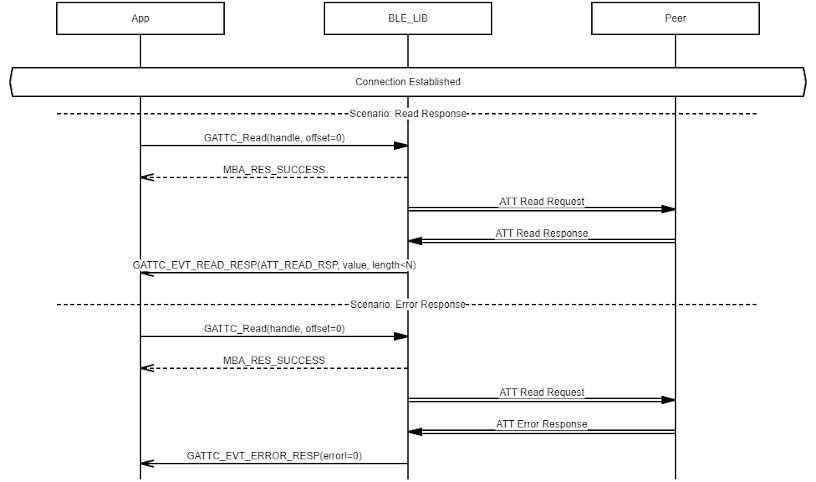

# GATTC Characteristic/Characteristic Descriptor Value Read

 

-   Example of GATTC Characteristic/Characteristic Descriptor Value Read \(N=ATT\_MTU-1\)

 

**Parent topic:**[Message Sequence Chart](GUID-F222E22D-493E-4F16-8480-6F7AAD168EB9.md)

