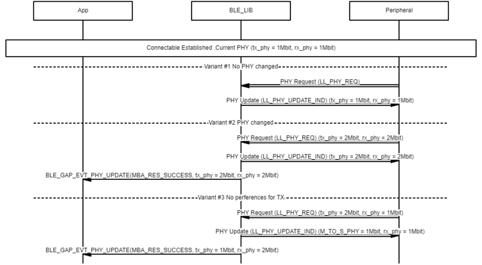
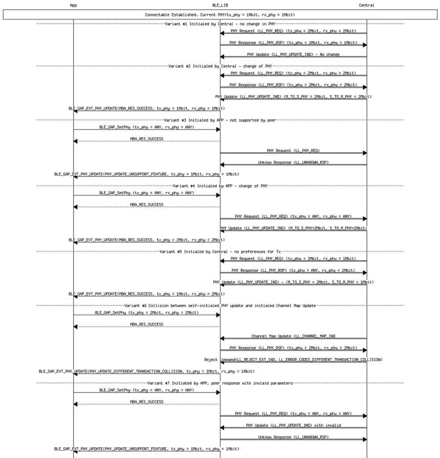
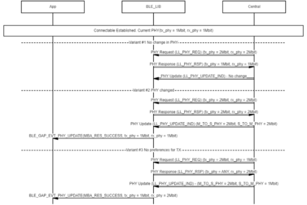
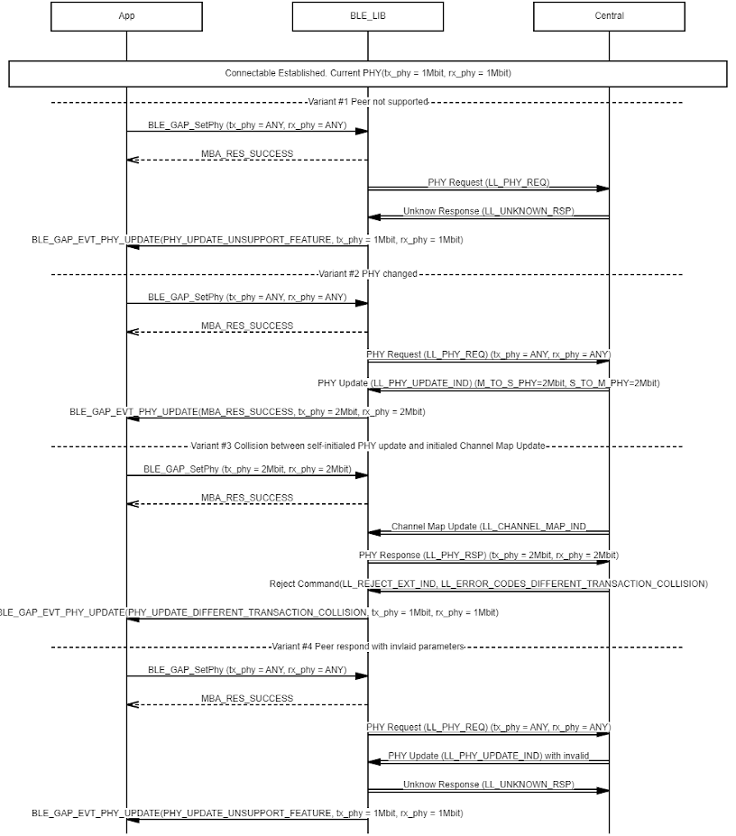

# GAP PHY Update procedure

## Example of Central Phy Update procedure - Initialed by peer

 

 

## Example of Peripheral Phy Update procedure - Initialed by APP

 

 

## Example of Peripheral Phy Update procedure - Initialed by peer

 

 

## Example of Peripheral Phy Update procedure - Initialed by APP

 

 

**Parent topic:**[Message Sequence Chart](GUID-30D405B5-0472-4B35-AD01-4DDF330F3091.md)

