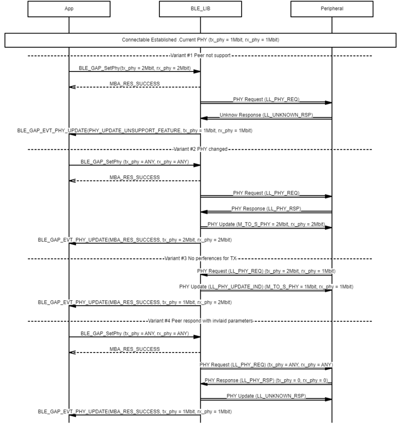

# GAP PHY Update procedure

 

-   Example of central PHY update procedure

 

 

-   Example of peripheral PHY Update procedure

 

**Parent topic:**[Message Sequence Chart](GUID-30D405B5-0472-4B35-AD01-4DDF330F3091.md)

