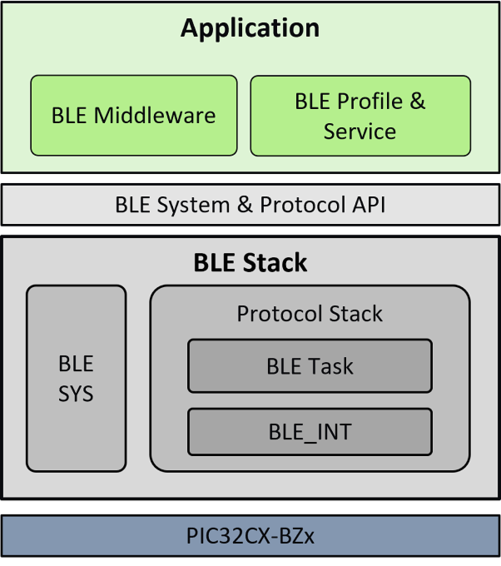

# BLE Software Specification

**Key Features**

 

-   Bluetooth 5.2 compliant single-mode Bluetooth Low Energy protocol stack \(BLE\_Stack\)

     

    -   Maximum to 6 BLE connections concurrently
    -   Configurable GAP roles of Peripheral, Central, Advertiser and Scanner
    -   Configurable GATT Client role
    -   Configurable features of BLE Extended and Periodic Advertisements
    -   Configurable features of Scanning for Extended and Periodic Advertisements
    -   L2CAP LE Credit Based Flow Control
    -   LE GATT Caching
    -   LE 1M, 2M and Coded PHY
    -   LL Privacy
    -   LE Secure Connections pairing model
    -   APIs for GAP, GATT, SM and L2CAP protocols access
    -   BT5.2 LE Power Control
     

-   BLE Middleware source codes provided to assist Application layer handling LE pairing device management, GATT database discovery, device firmware update and HCI virtual sniffer log etc
-   Microchip proprietary Transparent Profile and Service source codes provided for GATT based transparent data exchange applications
-   Microchip proprietary Credit Based Transparent Profile and Service source codes provided for L2CAP CoC transparent data exchange applications
-   Microchip proprietary OTA Profile and Service source codes provided for OTA DFU feature implementation

 

 

 

-   **[Initializing the BLE Software](GUID-24EA5598-FCEE-4072-9B6E-9543D8749FC5.md)**  

-   **[Using the BLE Software](GUID-D1093D0F-FEED-4585-90D3-CFBB87FE1839.md)**  

-   **[BLE Memory Usage](GUID-69E1BB6C-2985-4893-8F78-3A3D0CF1C54B.md)**  

-   **[BLE PTA](GUID-B51CB84B-C796-47F2-B083-EB2F0302AC33.md)**  

**Parent topic:**[PIC32CX-BZ3/WBZ35x](GUID-1F6AF334-EDDF-4C37-8BAE-9B246FD37EE5.md)

