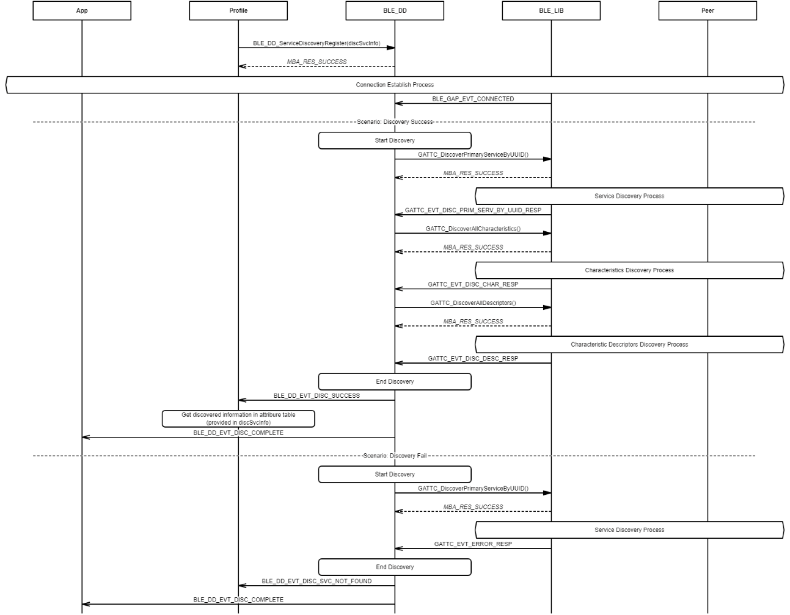
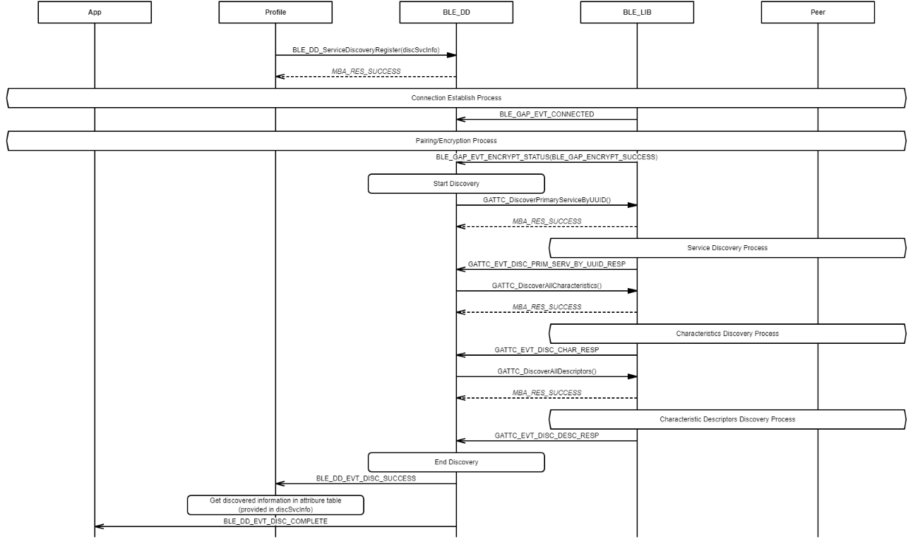
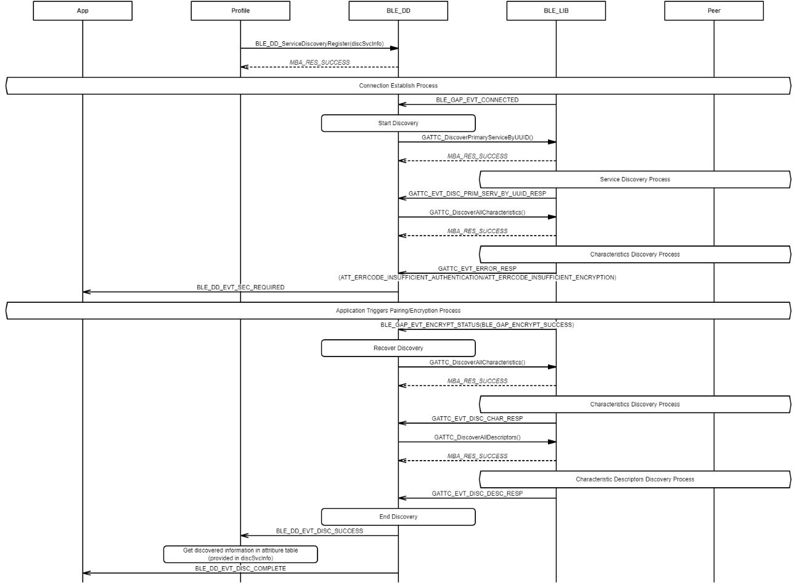

# Database Discovery Process

## Example of database discovery after connected

 

 

## Example of database discovery after connected and paired/encrypted

 

 

## Example of database discovery interrupted by security

 

 

**Parent topic:**[Message Sequence Chart](GUID-92488830-E17D-4AA1-9A3C-BEC23C905D64.md)

