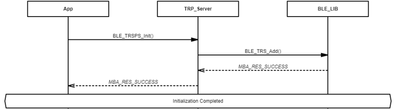
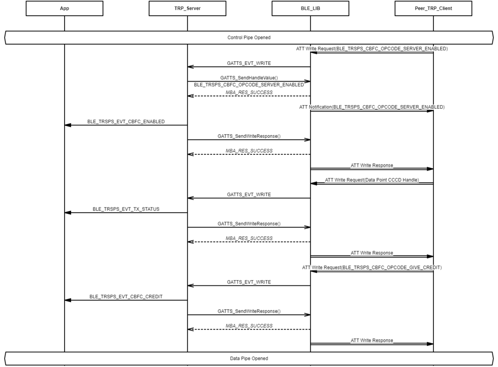

# Transparent Profile Server Role Initialization and Connection Establishment Procedure

 

-   Example of Transparent Profile Server Role Initialization

 

 

-   Example of Opening Transparent Profile Server Role Control Pipe

 

 

-   Example of Opening Transparent Profile Server Role Data Pipe

 

**Parent topic:**[Message Sequence Chart](GUID-3D4E2E63-0227-40ED-BBB4-0E93622C38E0.md)

