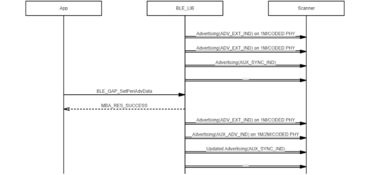
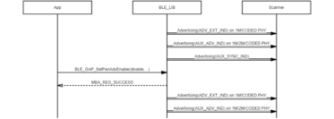
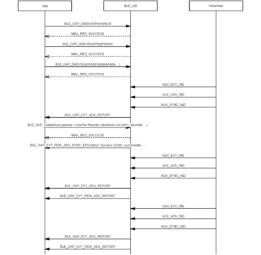

# GAP Periodic advertising and create sync procedure

## Example of starting periodic advertising

 

 

## Example of changing periodic adv data under periodic adv enabled

 

 

## Example of changing periodic adv parameter under periodic adv enabled

 

 

## Example of stopping periodic adv under periodic adv enabled

 

 

## Example of becoming peripheral role under periodic adv enabled

 

 

## Example of starting periodic adv create sync

 

 

## Example of cancelling create sync command when it is pending

 

 

## xample of setting dev to periodic adv list

 

 

## Example of setting periodic adv RX disabled and enabled

 

 

## Example of terminating periodic adv sync

 

 

## Example of becoming central connects to extended advertisers procedure under periodic advertising established

 

 

**Parent topic:**[Message Sequence Chart](GUID-1A7E8B4B-B471-43E1-BC73-81D705900D18.md)

