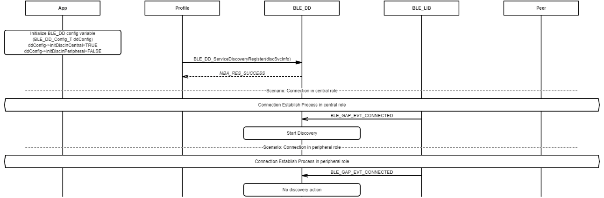
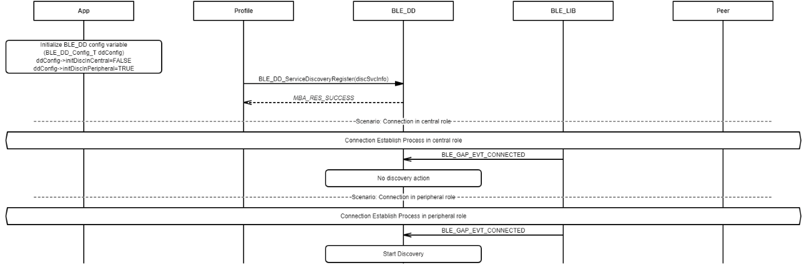
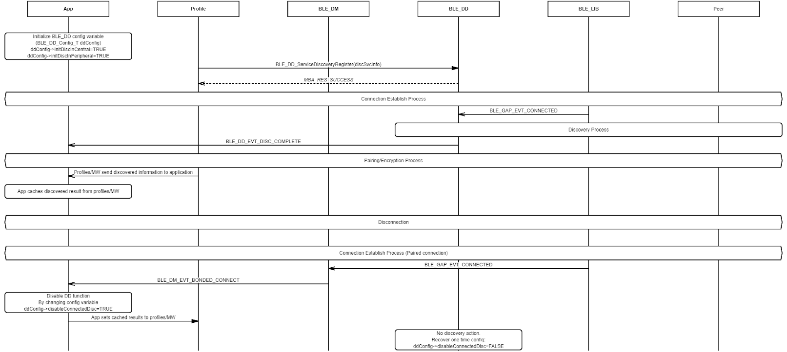

# Configure Database Discovery Function and Disable Discovery at Run Time

 

-   Example of configuring database discovery function enabled in GAP central role

 

-   Example of configuring database discovery function enabled in GAP peripheral role

-   Example of disabling \(one time disable\) database discovery function at run time \(discovered results cached for paired connection\)

**Parent topic:**[Message Sequence Chart](GUID-92488830-E17D-4AA1-9A3C-BEC23C905D64.md)

