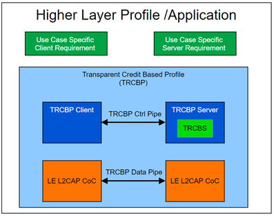

# Role/Service Relationships

The following diagram illustrates the relationships between service and profile roles.

A Transparent Credit Based Server shall instantiate the Transparent Credit Based Service  \(TRCBS\) [\[1\]](GUID-AA9F6190-9E01-48C5-A22A-6BC2FE3B90B6.md).  As shown above, a higher layer specification is required to provide additional  requirements on top of TRCBP that are specific to the need of the use case.

**Parent topic:**[Configuration](GUID-6DCDDD1D-6C33-4269-A252-E1ED3EC058FC.md)

