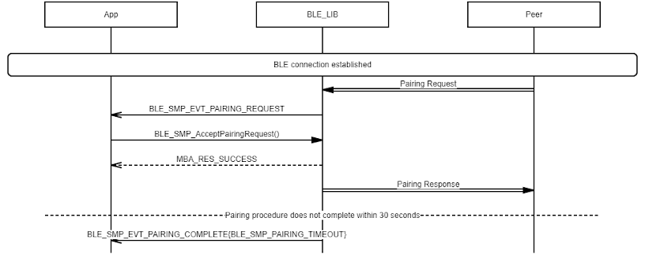

# SMP Pairing Timeout Procedure

 

-   Example of SMP Central Pairing Timeout

 

 

-   Example of SMP Peripheral Pairing Timeout

 

**Parent topic:**[Message Sequence Chart](GUID-D0C13598-2B10-4D13-B20A-8FE097B7D2FC.md)

